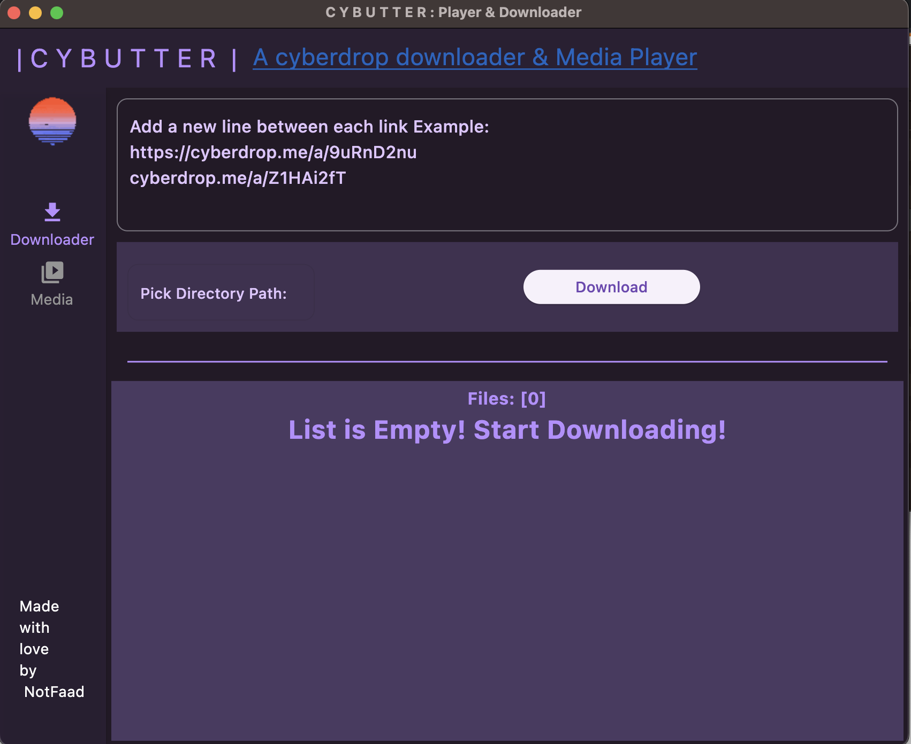
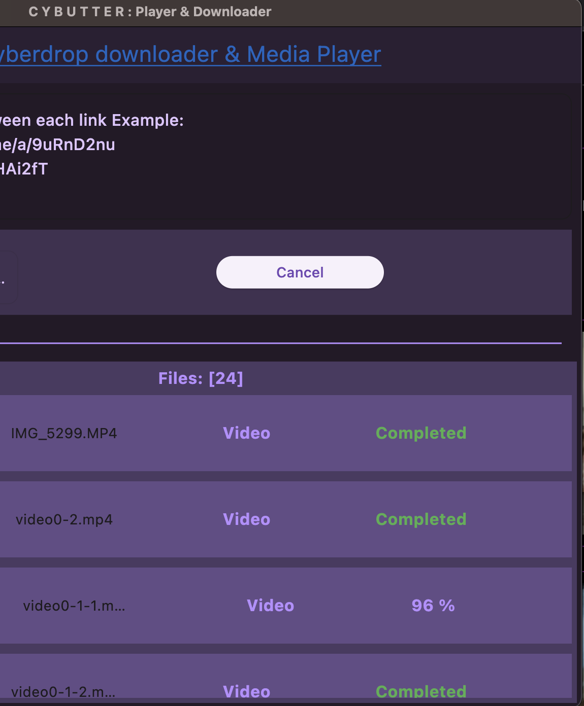

# Cybutter
A Cyberdrop Downloader and Media Player made in Flutter.

## Note(Early release):
Expect The application to be buggy

**If you  experienced any issue please open a ticket to help the development of the application.**

## Screenshots:
<h4> Downloader: </h4>

<h4> Downloading Files: </h4>

<h4> Media Player: </h4>

<h4> Photo Viewer: </h4>

## Roadmap:

- [x] Single Download
- [x] Multi links download
- [ ] Multi-Threaded downloader
- [ ] Coomer.Party Downloader and player
- [ ] Support multiple hosts.
- [ ] Download retry using different servers subsystem.
- [ ] Android application. 

